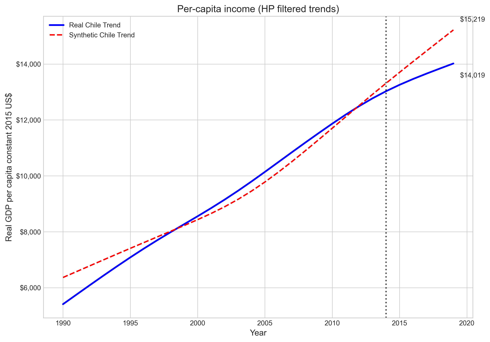
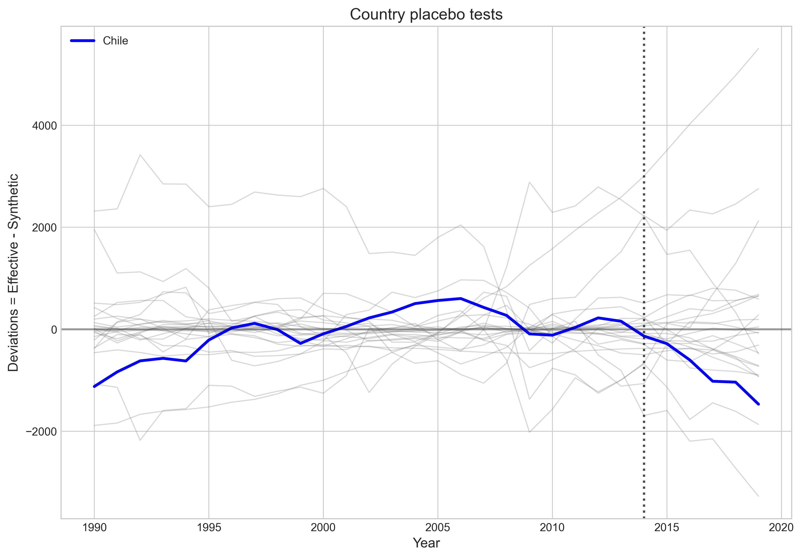
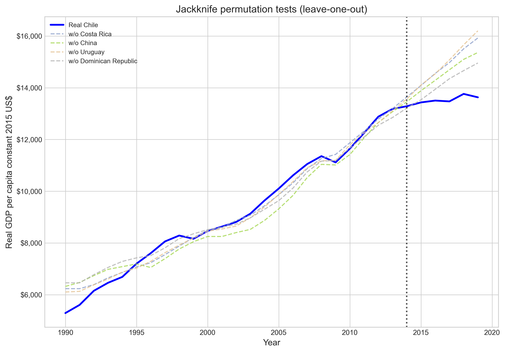

# Policy Changes and Growth Slowdown
## Assessing the Lost Decade of the Latin American Miracle

**Toni, Paniagua & Ordenes (2023)**

Replication Code & Analysis

---

# Overview

**Research Question:** What caused Chile's economic slowdown after 2014?

**Key Finding:** At least **two-thirds** of Chile's growth slowdown is attributable to **internal policy factors**, with external factors (commodity super-cycle end) playing a secondary role.

**Impact:**
- ~10% reduction in real GDP per capita over 5 years (2014-2019)
- 1.8% decline in average GDP growth rates

---

# The Chilean Puzzle

<div class="columns">
<div>

### The Miracle (1990-2013)
- Poster child of Latin American growth
- GDP per capita growth: 3.5-4.6% annually
- Poverty reduction, wage growth
- Convergence toward developed economies

### The Lost Decade (2014-2024)
- Growth rate: 0.6% per capita annually
- Stopped converging, began diverging
- Stagnant real wages
- Productivity sluggishness

</div>
<div>

### Two Concurrent Events
1. **External:** End of commodity super-cycle (copper prices fell ~50%)
2. **Internal:** 2014 policy regime change under Bachelet's second government

</div>
</div>

---

# The 2014 Policy Regime Change

Six major reforms implemented simultaneously:

1. **Tax Reform** - Corporate tax: 20% to 27% (highest increase in OECD)
2. **Education Reform** - De-privatization, end for-profit entities
3. **Electoral Reform** - Changed electoral system
4. **Constitutional Process** - Attempt to replace Pinochet-era constitution
5. **Labor Market Reform** - Strengthened union bargaining power
6. **Pension Reform** - Increased state role in social security

> "Bachelet vowed to enact multi-dimensional change... 'policies that change cultures'" - Benedikter et al. (2016)

---

# Methodology: Synthetic Control Method (SCM)

**Approach:** Construct counterfactual "Synthetic Chile" from weighted combination of donor countries

<div class="columns">
<div>

### Donor Pool (22 countries)
- **Latin America:** Argentina, Bolivia, Brazil, Colombia, Costa Rica, etc.
- **Commodity exporters:** Australia, China, South Africa
- **Colonial ties:** Spain, Portugal
- **Trade partners:** Canada, USA, Philippines

</div>
<div>

### Key Weights
| Country | Weight |
|---------|--------|
| Costa Rica | 0.514 |
| China | 0.260 |
| Uruguay | 0.170 |
| Australia | 0.048 |

</div>
</div>

---

# Predictor Variables

| Variable | Actual Chile | Synthetic Chile | Source |
|----------|-------------|-----------------|--------|
| GDP per capita | 9,200 | 9,245 | World Bank |
| Population Growth | 1.20 | 1.30 | World Bank |
| Life Expectancy | 76.64 | 76.04 | World Bank |
| Gross Capital Formation | 25.46 | 25.30 | Penn World Table |
| Trade Openness | 62.59 | 63.42 | Our World in Data |
| Mean Years Schooling | 9.30 | 7.34 | UNDP HDI |

GDP lags included: 1990, 1995, 2000, 2005, 2010, 2013

---

# SCM Results: Main Finding


**By 2019:** Actual Chile $13,761 vs Synthetic Chile $15,106 = **$1,345 gap (~10%)**

---

# Long-Run Trend Analysis (HP Filter)



Sharp divergence in long-run growth trend after 2014 treatment

---

# Decomposition: Internal vs External Factors


**Result:** ~2/3 internal factors, ~1/3 external factors

---

# Bayesian Structural Time Series (BSTS)


95% confidence intervals from 10,000 MCMC simulations confirm SCM results

---

# Growth Rate Impact


**Average Growth 2015-2019:** Actual 2.0% vs Synthetic 3.8% = **1.8% gap**

---

# Robustness: Country Placebo Tests



Chile shows largest divergence among all donor countries post-2014

---

# Statistical Significance


Results significant at 90% confidence interval for final post-treatment years

---

# Robustness: Jackknife Tests



Results robust to leave-one-out permutation tests

---

# Code Implementation

```python
# Run complete analysis
uv run replicate.py

# Key modules
src/
    synthetic_control.py  # SCM with nested optimization
    causal_impact.py      # BSTS implementation
    visualization.py      # Figure generation
```

**Dependencies:** cvxpy, statsmodels, scipy, pandas, matplotlib, wbgapi

---

# Key Contributions

1. **Quantitative evidence** for internal vs external decomposition
2. **Methodological rigor** - SCM + BSTS with comprehensive robustness tests
3. **Policy implications** for developing economies

### Channels of Impact
- Corporate tax increase hindered capital accumulation
- Political rhetoric generated uncertainty
- Electoral/constitutional changes signaled instability

---

# Conclusions

- Chile's "lost decade" was **primarily self-inflicted**
- Policy regime changes in 2014 cost Chile **~10% of GDP per capita**
- External shocks (commodity prices) explain **only ~1/3** of slowdown
- Results consistent with literature on tax shocks and political instability

> "Economic success is never a given... cases such as Chile highlight how rhetoric and policy shifts could affect the long-run trend in economic growth"

---

# References

<div class="small">

- Abadie, A. (2021). Using synthetic controls. *Journal of Economic Literature*
- Brodersen, K. et al. (2015). Inferring causal impact using BSTS. *Annals of Applied Statistics*
- Toni, E., Paniagua, P., & Ordenes, P. (2023). Policy Changes and Growth Slowdown. *SSRN*
- Edwards, S. (2023). *The Chile Project*. Princeton University Press

**Data Sources:** World Bank WDI, Penn World Table, UNDP HDI, Our World in Data

**Code:** Python 3.12+ with uv package management

</div>

---

# Thank You

<div class="center">

**Replication Code Available**

`uv run replicate.py`

---

Paper: Toni, Paniagua & Ordenes (2023)
DOI: 10.2139/ssrn.4640416

</div>
